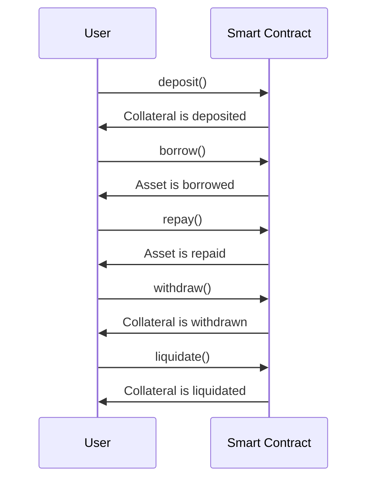

```mermaid
sequenceDiagram
participant User
participant Smart Contract
User->>Smart Contract: deposit()
Smart Contract->>User: Collateral is deposited
User->>Smart Contract: borrow()
Smart Contract->>User: Asset is borrowed
User->>Smart Contract: repay()
Smart Contract->>User: Asset is repaid
User->>Smart Contract: withdraw()
Smart Contract->>User: Collateral is withdrawn
User->>Smart Contract: liquidate()
Smart Contract->>User: Collateral is liquidated
```
