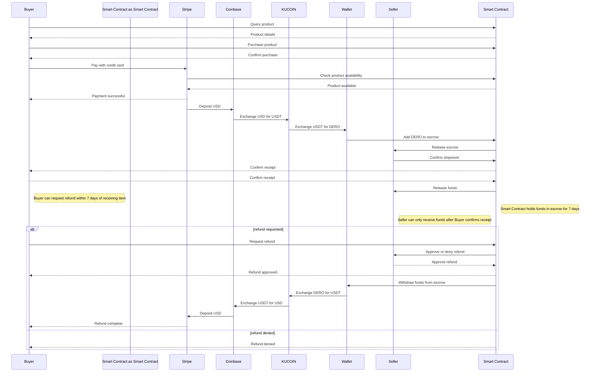

```mermaid 
sequenceDiagram
participant Buyer as Buyer
participant Smart Contract as Smart Contract
participant Stripe as Stripe
participant Coinbase as Coinbase
participant KUCOIN as KUCOIN
participant Wallet as Wallet
participant Seller as Seller

Buyer->>Smart Contract: Query product
Smart Contract-->>Buyer: Product details
Buyer->>Smart Contract: Purchase product
Smart Contract-->>Buyer: Confirm purchase
Buyer->>Stripe: Pay with credit card
Stripe->>Smart Contract: Check product availability
Smart Contract-->>Stripe: Product available
Stripe-->>Buyer: Payment successful
Stripe->>Coinbase: Deposit USD
Coinbase->>KUCOIN: Exchange USD for USDT
KUCOIN->>Wallet: Exchange USDT for DERO
Wallet->>Smart Contract: Add DERO to escrow
Smart Contract->>Seller: Release escrow
Seller->>Smart Contract: Confirm shipment
Smart Contract-->>Buyer: Confirm receipt
Buyer-->>Smart Contract: Confirm receipt
Smart Contract->>Seller: Release funds

Note right of Buyer: Buyer can request refund within 7 days of receiving item
Note right of Smart Contract: Smart Contract holds funds in escrow for 7 days
Note right of Seller: Seller can only receive funds after Buyer confirms receipt

alt refund requested
    Buyer->>Smart Contract: Request refund
    Smart Contract->>Seller: Approve or deny refund
    Seller-->>Smart Contract: Approve refund
    Smart Contract-->>Buyer: Refund approved
    Smart Contract->>Wallet: Withdraw funds from escrow
    Wallet->>KUCOIN: Exchange DERO for USDT
    KUCOIN->>Coinbase: Exchange USDT for USD
    Coinbase->>Stripe: Deposit USD
    Stripe-->>Buyer: Refund complete
else refund denied
    Smart Contract-->>Buyer: Refund denied
end

```
