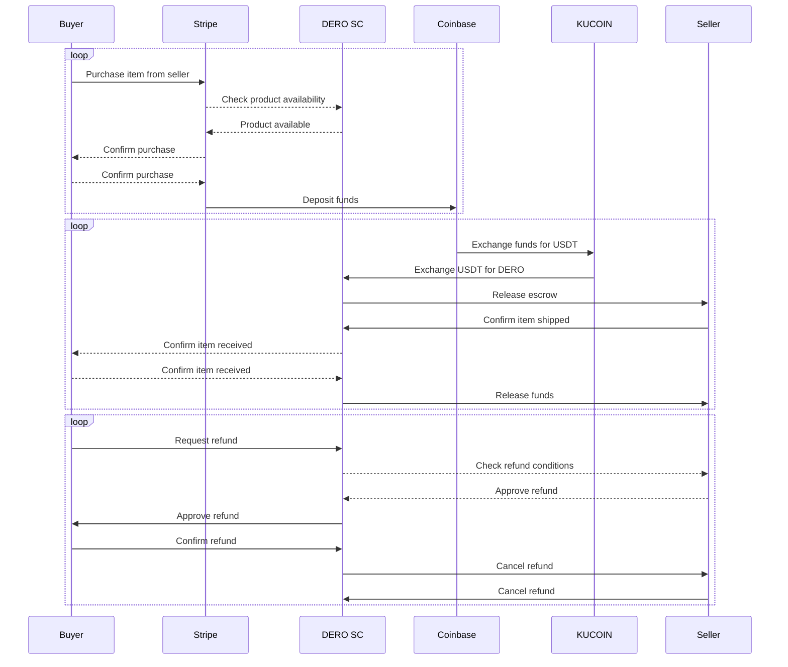

```mermaid 
sequenceDiagram
    loop
        Buyer->>Stripe: Purchase item from seller
        Stripe-->>DERO SC: Check product availability
        DERO SC-->>Stripe: Product available
        Stripe-->>Buyer: Confirm purchase
        Buyer-->>Stripe: Confirm purchase
        Stripe->>Coinbase: Deposit funds
    end
    loop
        Coinbase->>KUCOIN: Exchange funds for USDT
        KUCOIN->>DERO SC: Exchange USDT for DERO
        DERO SC->>Seller: Release escrow
        Seller->>DERO SC: Confirm item shipped
        DERO SC-->>Buyer: Confirm item received
        Buyer-->>DERO SC: Confirm item received
        DERO SC->>Seller: Release funds
    end
    loop
        Buyer->>DERO SC: Request refund
        DERO SC-->>Seller: Check refund conditions
        Seller-->>DERO SC: Approve refund
        DERO SC->>Buyer: Approve refund
        Buyer->>DERO SC: Confirm refund
        DERO SC->>Seller: Cancel refund
        Seller->>DERO SC: Cancel refund
    end


```
